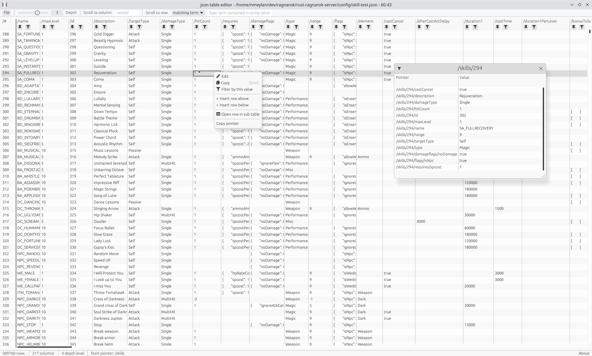

# Important
**Memory usage**: While this tool allow to edit large json file smoothly, it consumes a lot of memory due to technical decision which tradeoff memory in favor of better performance for navigation, edition and serialization. Read below section "Performance and Memory usage" for more details

[Web demo](https://nmeylan.github.io/json-table-editor/) or launch it with [trunk](https://trunkrs.dev/) using `trunk serve`

# Genesis
I wanted to edit a [small json file](https://github.com/nmeylan/rust-ro/blob/master/config/skill.json) of 1.5mb, using a table view, javascript based tools like http://json2table.com/# and https://jsongrid.com/json-grid were too slow to edit this file and barely usable, so I decided to attempt to do it myself

# Features
## Implemented
- *lag-free* visualisation of large json array: only visible rows and columns are rendered
- Select column to render
- Filter out rows with null value at given columns
- Scroll to column
- Pin columns to left
- Open nested array in sub-table
- Open nested Object in sub-table
- Select depth for nested object
- Edit cell
- Filter columns by values
- Go to row number
- Search for matching terms
- Copy/Paste cell
- Insert row above/below another row

# Usage
- You can launch the tool without arguments by executing the executable
- You can launch the tool with arguments `./json-editor [PATH_TO_JSON] [JSON_POINTER]`
- Right click on cells to display a contextual menu



Json in video below is 372mb with an array of 309_759 entries, containing nested objects, it runs at ~60fps on an intel graphics chipset (Mesa UHD 630) as only visible cell are rendered


https://github.com/nmeylan/json-table-editor/assets/1909074/6a4f932d-031c-4611-9627-2e2787da5401


## Performance and Memory usage
This editor use a custom json parser to deserialize json into a flat data structure allowing `O(n)` data access where `n` is number of fields of an array element, containing `k` elements. In general `n` not bigger than 200 but `k` can easily be >100000. 
While it is not the fastest parser on the market, it is still faster to use our custom parser instead of parsing using serde or other library generating tree data structure and then convert it to flat data structure. 

As this structure is flat, it also allows to parse only a subset of json files by defining a depth limit, the json files is still fully read but after a given depth, 
content is not deserialize we only keep raw content as String which then can be parse later, by changing depth.

This mechanism allow fast parsing of big json files, but consume more memory as for each depth level we store the full string and the parsed content.
Additionally, this mechanism allow to serialize only row that have been changed, unchanged rows are already serialized, speeding up edition of big files.

# Disclaimers
This tool has not yet reached a stable version, thus it has the following limitations:

- If you open a non-valid json file, tool will crash, there is currently no graceful handling for json parser error
- If you open a json file starting by an object, you will be able to edit an array of your choice at the given `json pointer`, When you do `save`, it will only save this array
Original json file
```json
{"skills": [], "count":  1000}
```
If you select pointer `/skills`, then save, it will produce this file
```json
{"skills": []}
```

# About
Licence: Apache 2

Credits: this project would not have been possible without [egui](https://github.com/emilk/egui) and its community, and maintainers of [dependencies](https://github.com/nmeylan/json-table-editor/blob/master/Cargo.lock) used by this project